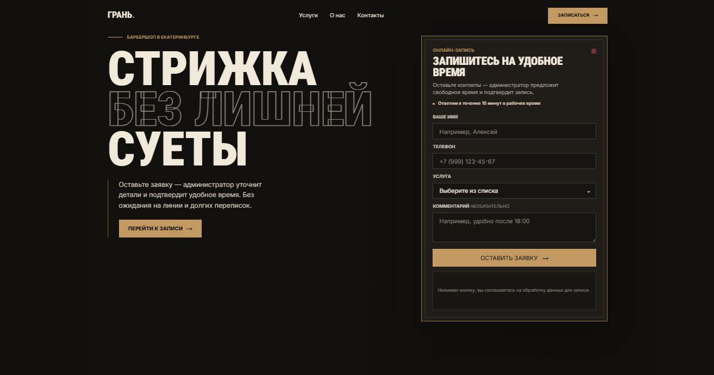

# ГРАНЬ — лендинг барбершопа



Коммерческое портфолио-демо для локального барбершопа в Екатеринбурге. Проект показывает полный сценарий записи: от выбора услуги на лендинге до уведомления администратора в Telegram.

## Задача

Собрать реалистичный сайт малого бизнеса с сильным первым экраном, понятными ценами, адаптивной формой и рабочей серверной интеграцией без базы данных и лишней инфраструктуры.

## Реализовано

- адаптивный premium/editorial лендинг;
- каталог услуг с ценами и длительностью;
- подстановка выбранной услуги в форму;
- российская телефонная маска и клиентская валидация;
- серверная валидация и нормализация данных;
- отправка заявок через Telegram Bot API;
- loading, success и error состояния без скачков layout;
- защита от простых ботов через honeypot;
- клавиатурная навигация, focus-состояния и reduced motion;
- Open Graph preview, favicon и CI-проверки.

## Стек

- Next.js App Router
- React
- TypeScript
- Tailwind CSS
- Next.js Route Handler
- Telegram Bot API

## Как работает сценарий

1. Посетитель выбирает услугу или переходит к форме через CTA.
2. Услуга автоматически подставляется в форму.
3. Клиент заполняет имя, российский номер телефона и комментарий.
4. Route Handler повторно проверяет данные на сервере.
5. Заявка отправляется администратору в Telegram в HTML-формате.
6. Пользователь получает понятный результат отправки на странице.

## Локальный запуск

Требуется Node.js 22 или новее.

```powershell
npm ci
Copy-Item .env.example .env.local
npm run dev
```

Заполните локальный файл `.env.local`:

```env
TELEGRAM_BOT_TOKEN=
TELEGRAM_CHAT_ID=
```

Секреты используются только в серверном обработчике и не должны иметь префикс `NEXT_PUBLIC_`.

## Структура

- `app/page.tsx` — секции лендинга;
- `app/lead-form.tsx` — форма, маска и клиентские состояния;
- `app/booking-flow.tsx` — выбор услуги, scroll и highlight формы;
- `app/services.ts` — единый каталог услуг;
- `app/api/lead/route.ts` — валидация и отправка в Telegram.

## Проверка

```powershell
npm run lint
npm run build
npm audit
```

## Deploy на Vercel

1. Импортируйте GitHub-репозиторий в Vercel.
2. Добавьте `TELEGRAM_BOT_TOKEN` и `TELEGRAM_CHAT_ID` в Environment Variables.
3. Выполните production deploy.
4. Проверьте отправку одной тестовой заявки и получение сообщения в Telegram.
5. Configure Vercel rate limiting or a Firewall rule for `/api/lead` before accepting public traffic.

Проект использует демонстрационные название, адрес, телефон и цены.
